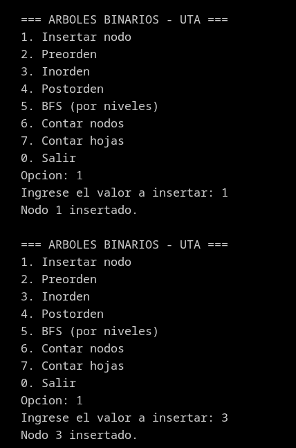
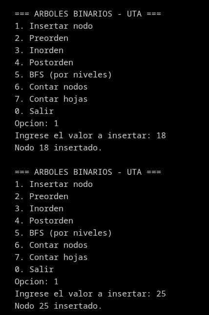
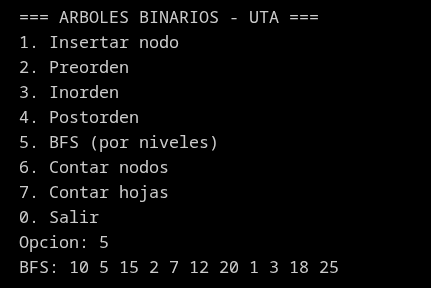
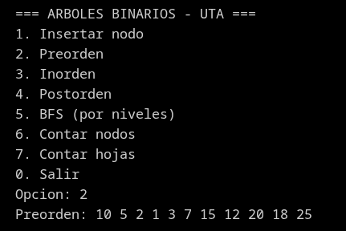
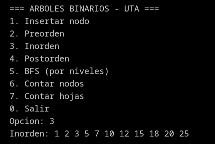
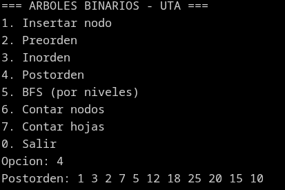
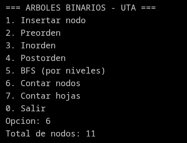
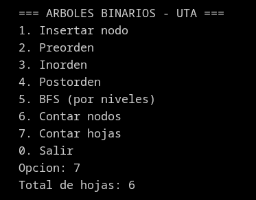

# Ejercicios para clase

## Ejercicio 1
Dado el árbol:

```text
        10
       /  \
      5    15
     / \   / \
    2   7 12 20
```

Escriba manualmente:

- Preorden
- Inorden
- Postorden
- BFS

## Ejercicio 2
Modifique el árbol anterior agregando los nodos 1, 3, 18 y 25. Ejecute nuevamente los recorridos.







## Ejercicio 3
Implemente una función que cuente la cantidad total de nodos del árbol.


## Ejercicio 4
Implemente una función que cuente las hojas del árbol.


## Ejercicio 5 aplicado al proyecto final
Represente los módulos de un sistema web como un árbol binario. Ejemplo:

```text
            Sistema Web
           /           \
     Usuarios        Inventario
      /    \          /      \
 Registrar Buscar  Productos Reportes
```

Explique qué recorrido usaría para:

1. Mostrar el menú principal.
2. Procesar primero los módulos internos.
3. Mostrar módulos nivel por nivel.
